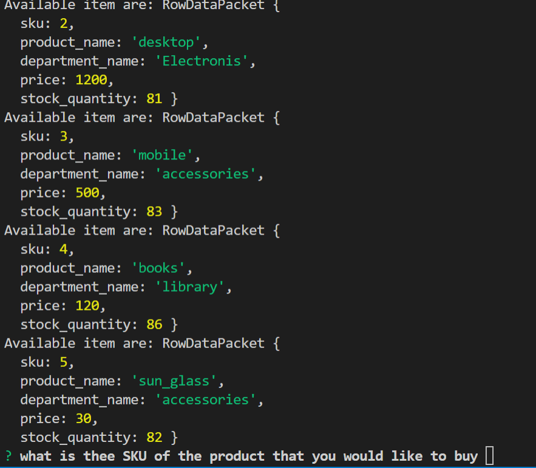
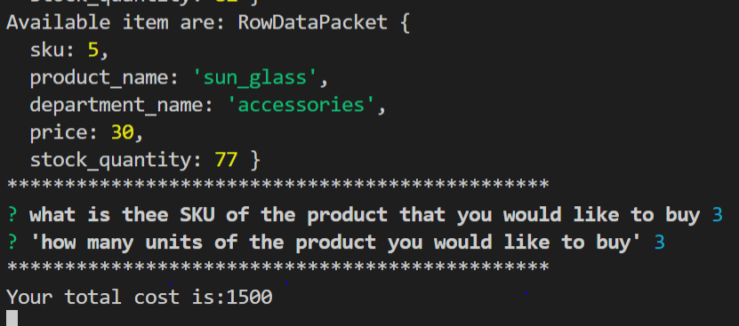
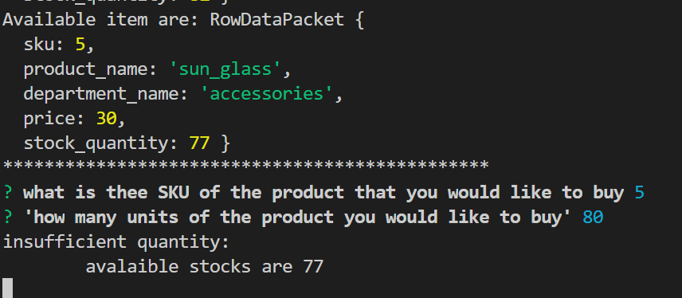

# node.js-and-Mysql
combining mysql and node.js. Here i am gonna use inquirer and Mysql packages.
* what the app do?
1. ask the user to put the id(sku) of the product 
2. ask how many products needed

images showing the functionality of the app

The app console log insufficient quantity when enough quantity not available 

