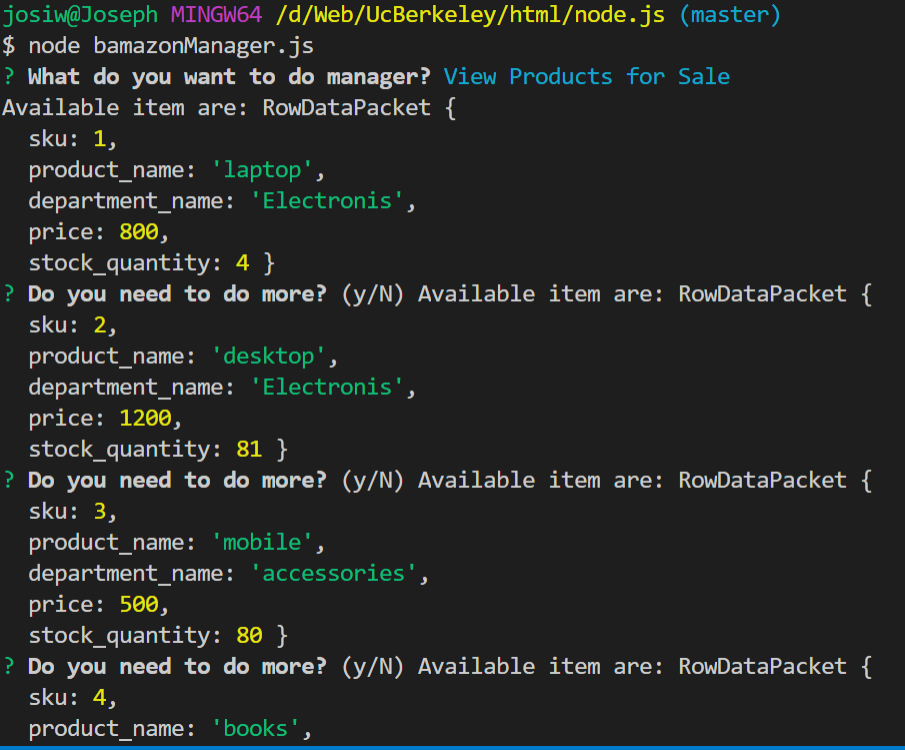
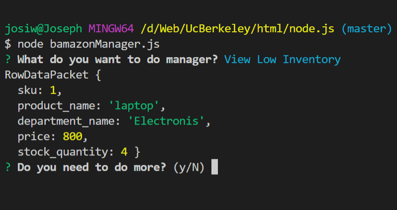
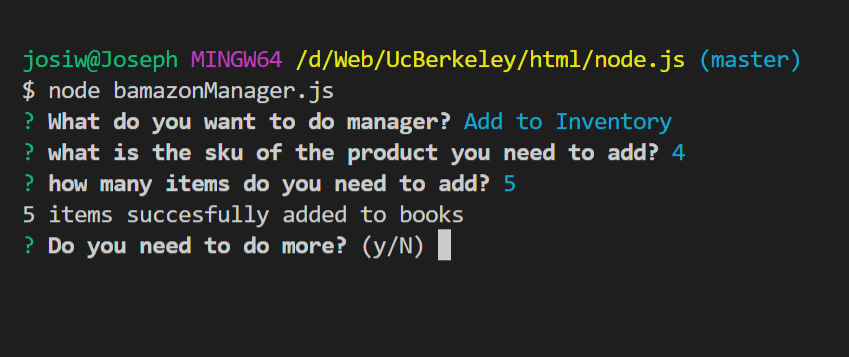
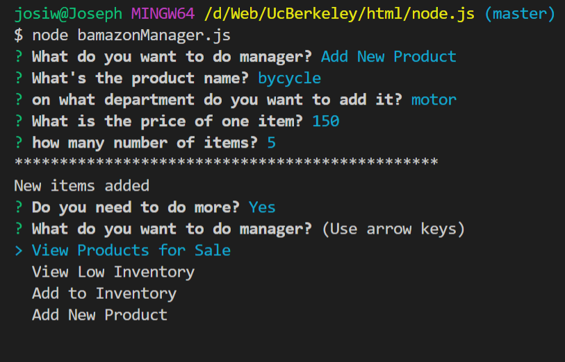
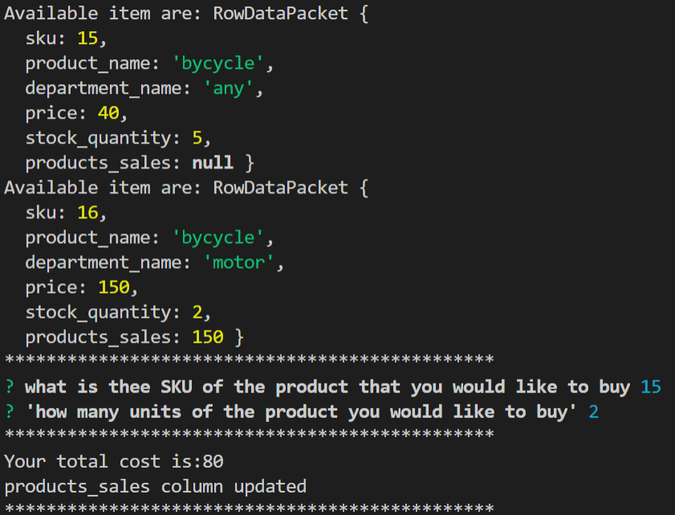
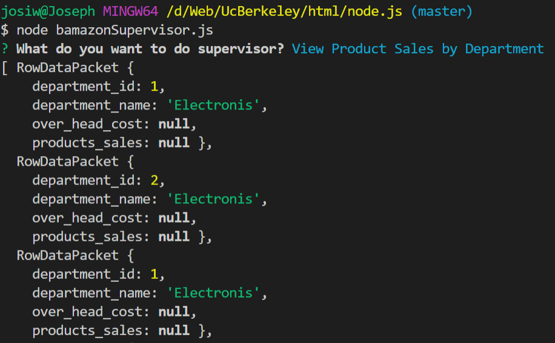

# node.js-and-Mysql
combining mysql and node.js. Here i am gonna use inquirer and Mysql packages.
* what the app do?
1. ask the user to put the id(sku) of the product 
2. ask how many products needed
3. calculate the amount price to the user 

images showing the functionality of the app

The app console log insufficient quantity when enough quantity not available 

## **challenge number-2**

the app helps the manger of the store to 
* View Products for Sale
    * image to view products 

        
* View Low Inventory
    * 
* Add to Inventory
    * 
* Add New Product
    * 
## **challenge number-3**
The app creates the products_sales column on the products table and able to update it from bamazon.js file

**supervisor to view profit column**

